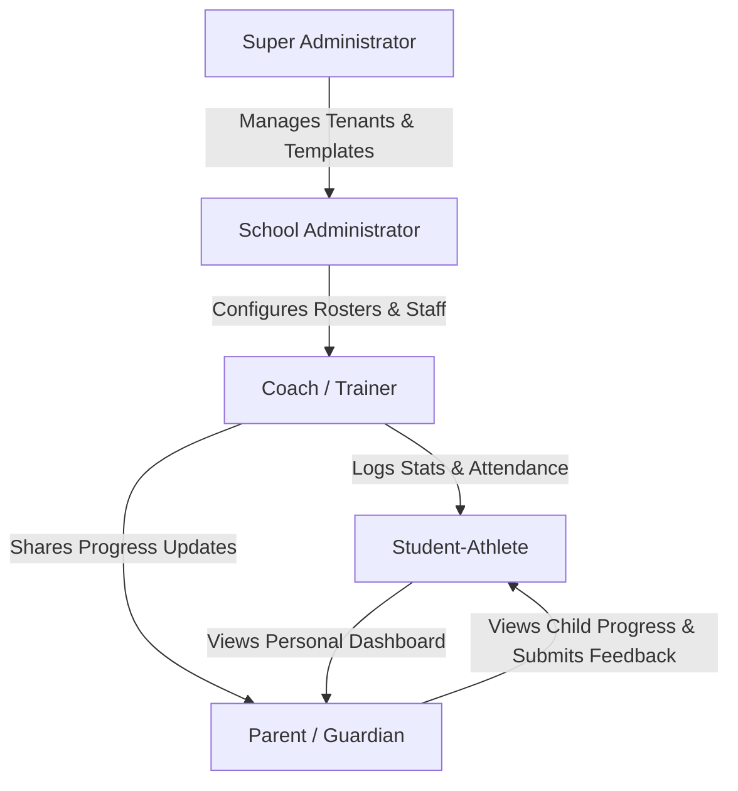

# uSPORT Player Development Tracker — Context & Background

## 1. Project Background
The uSPORT Player Development Tracker is a comprehensive athlete tracking and evaluation platform. Originally created as an Excel-based spreadsheet system (`uSport_Player_Tracker_v4.xlsx`) for schools like Hoërskool Overkruin, the system is designed to monitor student-athletes across three core development pillars:
1. **Mind (Academics):** Academic grades and classroom performance.
2. **Body (Fitness & Matches):** Physical fitness baselines, progression over time, and match-day statistics.
3. **Spirit (Discipline & Community):** Attendance at uGroups, general discipline record, and parent-coach feedback loops.

The current Excel-based system, while highly functional, suffers from several operational bottlenecks:
- **High Administrative Overhead:** Coaches spend hours per week manually typing stats on their laptops or phones.
- **Data Siloing:** Data is stored in individual files, preventing real-time access for students, parents, and administrative staff.
- **Lack of Outdoor Usability:** Entering detailed statistical metrics on a spreadsheet while standing on a rugby, netball, or soccer field is extremely difficult.
- **Lack of Scalability:** The spreadsheet is built for a single school/team. To scale nationwide across hundreds of schools and multiple sports, a cloud-native, multi-tenant SaaS architecture is required.

---

## 2. Stakeholder Analysis

The uSPORT ecosystem serves four distinct user roles, each with unique needs and access patterns:

### A. Super Administrator (System Owner)
- **Who:** The uSPORT core operational team.
- **Needs:** Multi-tenant billing, creation of new school tenants, definition of global sports templates (e.g., Rugby, Soccer, Netball), and global system health monitoring.
- **Platform:** Web Admin Portal.

### B. School Administrator (School Level)
- **Who:** School Sports Directors or Department Heads.
- **Needs:** Managing school rosters, importing master student lists, uploading school academic grade reports via bulk Excel/CSV files, assigning coaches to teams, and configuring school-wide parameters.
- **Platform:** Web Admin Portal (Desktop-focused).

### C. Coach (The Field Operator)
- **Who:** Team coaches, fitness trainers, and uGroup leaders.
- **Needs:** Ultra-rapid mobile interface to log match statistics live, take attendance in under 10 seconds, record fitness baseline tests, write voice-to-text notes, and view alerts for "at-risk" players.
- **Platform:** Mobile App (iOS & Android).

### D. Student-Athlete
- **Who:** High school students participating in the sports program.
- **Needs:** View their own dashboard, check personal bests (PBs) in the gym, track academic trends against the "University Ready" (65%+) benchmark, and receive motivational nudges.
- **Platform:** Mobile App (Read-Only Portal).

### E. Parent / Guardian (Future Phase)
- **Who:** Parents of the student-athletes.
- **Needs:** View their children's multi-dimensional progress, review teacher/coach remarks, and submit required term feedback.
- **Platform:** Mobile App (Read-Only Portal with secure linking).

---

## 3. Technology Stack Selection Rationale

To deliver a scalable, low-latency, and cost-effective nationwide SaaS, the platform relies on the **Cloudflare Edge Ecosystem** for the backend/web and **Flutter** for the mobile applications.

| Layer | Technology | Rationale |
| :--- | :--- | :--- |
| **Mobile App** | **Flutter (Dart)** | Single codebase compiling to high-performance native iOS and Android apps. Direct support for offline-first storage engines (Hive/SQLite) for field usage. |
| **Web Portal** | **HTML5 + Alpine.js** | Ultra-lightweight reactive framework. Allows building rich dashboard components, login flows, and CSV parsers without the overhead of heavy frameworks like React. |
| **Styling** | **Tailwind CSS** | Standardized, mobile-first utility classes. Ensures a clean, modern design language that compiles down to minimal CSS files. |
| **API Backend** | **Cloudflare Workers (Hono + TS)** | Serverless edge execution. Requests are handled at the nearest edge node, ensuring zero-latency data syncing for coaches on the field. |
| **Database** | **Cloudflare D1 (SQL)** | Relational database at the edge. Highly structured schemas ensure strict tenant isolation (`school_id`), referential integrity, and SQL efficiency. |
| **Roster Cache** | **Workers KV** | High-read, low-latency key-value store. Caches active student rosters and authorization states so mobile apps load instantly on the field. |
| **Media & CSVs** | **Cloudflare R2** | S3-compatible object storage. Securely stores player profile photos, school logos, and raw uploaded CSV grade files. |

---

## 4. Multi-Sport & Nationwide Expansion Strategy

While the pilot is rolling out for rugby at Hoërskool Overkruin, the architecture is built to support any sport (Netball, Soccer, Athletics, Cricket) and scale to thousands of schools.

- **Dynamic Sport Templates:** Rather than hardcoding rugby stats (Tackles, Carries, Metres) in the database columns, the platform uses a JSON-based stats structure. The system looks up the school's active `sport_id` and dynamically generates the mobile logging buttons and dashboard labels.
- **RAG Legend Standardization:** The color-coded health indicators (Red, Amber, Orange, Green) are normalized across the platform, allowing parents and schools to evaluate academic and athletic performance under a unified rubric.
